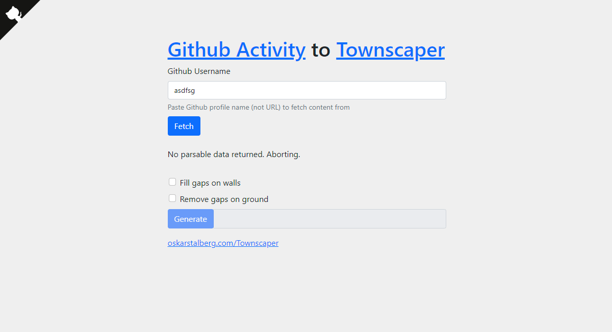

# Git2Townscaper

Git2Townscaper is meant to convert a github profile activity graph into Townscaper houses using the graph levels of activity for coloring. Because Townscaper is limited in how many blocks you can build horizontally, the scripts turns the graph from a day-by-day activity to a month activity, and the height of the buildings represent the level of activity summed up for that month. Currently it only takes what Github shows by default on your profile (no year selection).

## Tech
This tool parses Github user profile URL's, and it uses Townclipper library to build hashes for Townscaper. This tool can be hosted on static HTML hosting, like Github.io.

## License
MIT

## Thanks
* https://github.com/tarmo888/Wordle2Townscaper
* https://github.com/alvaro-cuesta/townsclipper
* https://github.com/tholman/github-corners
* https://github.com/twbs/bootstrap
* https://allorigins.win/